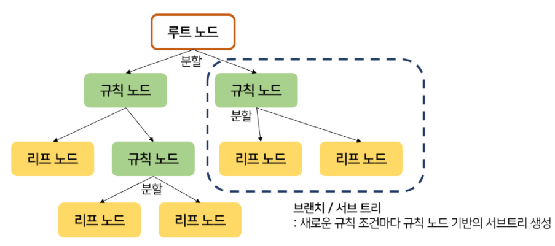
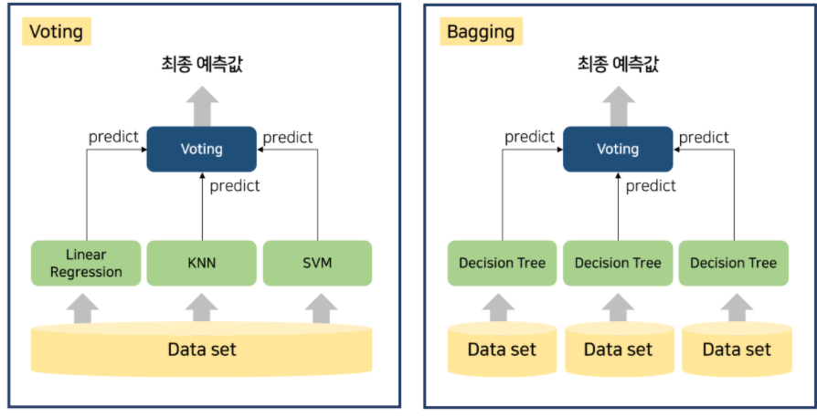

# Classification

**: 학습 데이터로 주어진 데이터의 피처와 레이블 값(결정값, 클래스 값)을 학습하여 모델을 생성하여 미지의 레이블 값을 예측하는 것**

## 1. 결정 트리 (decision tree)

### (1) 개요

- 루트 노드 : 처음 상태
- 규칙 노드 : 분류 규칙 조건
  - 규칙이 많다 = 분류 결정 방식이 복잡, 과적합 가능성 높음, 트리 깊이(depth) 깊음
- 리프 노드 : 규칙에 따라 결정된 클래스 값
- 서브 트리 : 새로운 규칙 조건마다 생성
- 분류 규칙 : 엔트로피/ 지니계수 : 정보의 균일도를 측정하는 대표적인 방법은 엔트로피를 이용한 정보 이득 지수와 지니계수가 있다.
  - 일반적으로 엔트로피를 더 많이쓴다. 

### (2) 결정 트리 모델의 특징

- **장점**
  1. 균일도 기반 → 알고리즘이 쉽고 직관적, 룰이 매우 명확 → **시각화 가능**
  2. 피처의 스케일링과 정규화 같은 전처리 작업 필요 없음

- **단점**
  1. 과적합으로 정확도가 떨어짐
     → 사전에 트리 크기 제한 같은 성능 튜닝 필요

### (3) 결정트리 파라미터

Sklearn : classifier과 regressor 제공, CART(classification and regression trees) 알고리즘 기반

- min_samples_split : 노드 분할의 최소 샘플 데이터 수(for 과적합 방지)

- min_samples_leaf : leaf node가 되기 위한 최소 샘플 데이터 수(for 과적합 방지)

  - 단, 비대칭적(imbalanced) 데이터의 경우 클래스별로 샘플 수 다름

- max_features : 최대 피처 개수

  - int : 정수개, float : ratio% , sqrt : 전체피처수‾‾‾‾‾‾‾‾‾√ , log : 𝑙𝑜𝑔2(전체피처개수), none : 전체 피처 선정

- max_depth : 최대 깊이, none의 경우 min_samples_split보다 작아질 때 까지 분할

- max_leaf_nodes : 최대 leaf nodes

  

## 2. 앙상블

: 여러개의 분류기를 생성하고 그 예측을 결합하는 모델링 방법

### (1) 앙상블의 대표 알고리즘 

**: 랜덤 포레스트 (bagging) & 그래디언트 부스트 (bagging)**

1. Voting : 같은 데이터셋에서 서로 다른 알고리즘 결합

2. Bagging :  같은 알고리즘에서 다른 데이터 셋으로 학습 후 결합 
   단, bagging의 경우 데이터의 중복을 허용하기 떄문에 교차검증과는 다름
   
   

### (2) Voting

- Hard voting : 다수결의 원칙 
- Soft voting : 레이블 값 결정 확률을 전체 평균으로 계산하여 가장 높은 값으로 결정
- Bootstrapping : 전체 데이터 건수와 동일하지만 개별 데이터가 중복된 서브 데이터셋 분할 방법
- 데이터셋이 완벽히 확률을 대변하지 않는다. 여기서 나온 모델 자체도 약간 하자가 있다.

## 3. 랜덤 포레스트 

: 대표적인 배깅 알고리즘 (같은 알고리즘으로 여러개의 분류기를 만들어서 보팅으로 최종 결정하는 알고리즘)

### (1) 랜덤 포레스트의 개요 

**장점** : 앙상블 알고리즘 중 비교적 빠른 수행 속도를 가지고 있으며 다양한 영역에서 높은 예측 성능을 보인다. 

랜덤포레스트는 여러개의 결정 트리 분류기가 전체 데이터에서 배깅 방식으로 각자의 데이터를 샘플링해 개별적으로 학습을 수행한 뒤 최종적으로 모든 분류기가 보팅을 통혜 예측 결정을 하게 된다.

### (2) 하이퍼하타미터 및 튜닝

**단점** : 하이퍼파라미터가 너무 많음, 시간 소요 많음

- n_estimators : 모델에서 사용할 트리 갯수(학습시 생성할 트리 갯수) => 무조건 넣어줘야함
- max_depth : 트리의 최대 깊이 => 많이 씀
- min_samples_split : 내부 노드를 분할하는데 필요한 최소 샘플 수 (default : 2) => 많이 씀

